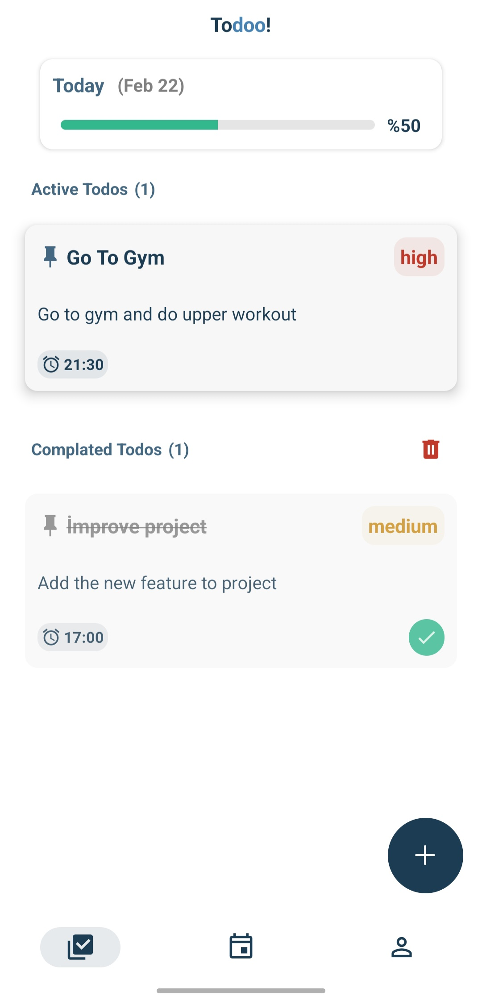
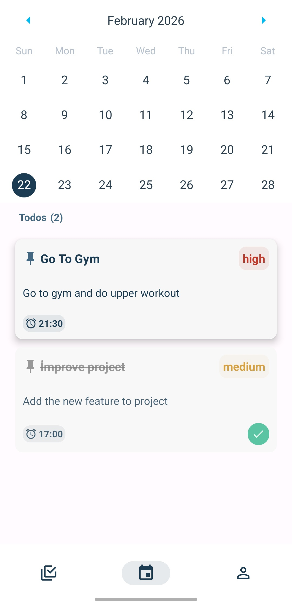

# 📝 Todoo App

A minimal and modern Todo application built with React Native and Expo.

## 📸 Screenshots

<p align="center" style="display: flex; justify-content: center; gap: 20px; align-items: center;">
  
  
  
</p>

## 🚀 Features

- Create, update and delete tasks
- Deadline support
- Firebase backend integration
- Clean and minimal UI

## 🛠 Tech Stack

- React Native
- Expo
- Firebase
- AsyncStorage

## 📦 Installation

Clone the repository:

```bash
git clone https://github.com/kullaniciadi/expo-todo-app.git
cd expo-todo-app
npm install
```

Start the project:

```bash
npx expo start
```

## 📱 Platform

- Android
- iOS

---

Built for learning and productivity.
